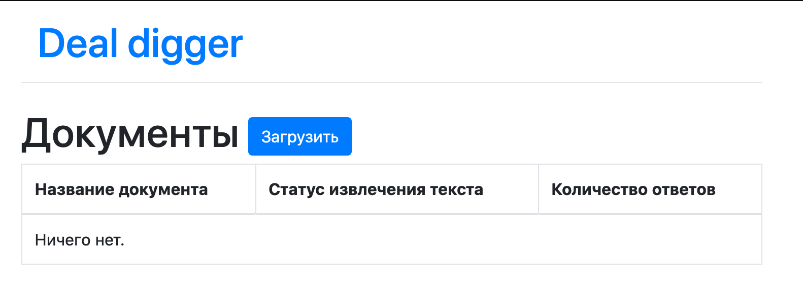
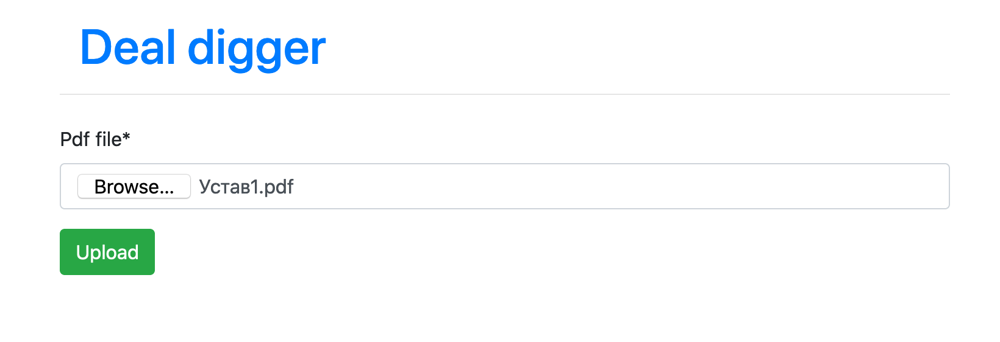
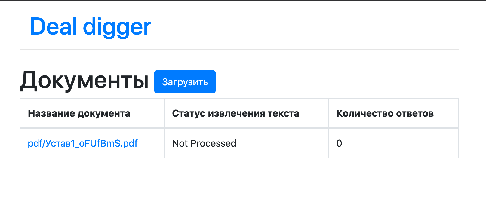
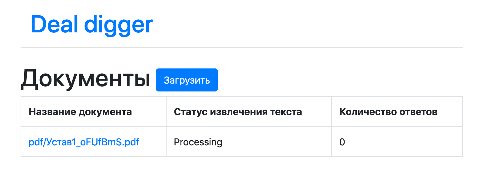
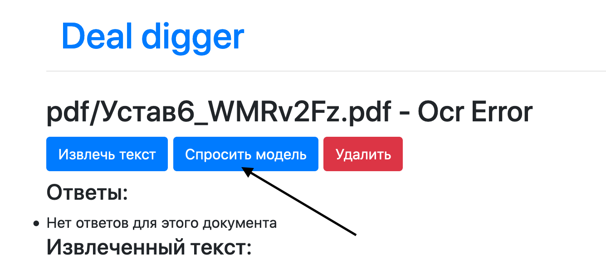

# Deal digger

## Деплой

Приложение API собирается из докер файла, для запуска требуется указать
порт через переменную `PORT`, по умолчанию 8000. Внимание! Для работы контейнера требуется 4Гб памяти!
 Избегайте OOM killer.

Деплой всех компонентов системы сконфигурирован через `docker-compose.yml`
 В соседней папке с проектом должен лежать проект `F-OCR-pdf-to-json`

Как запустить:

* билдим все контейнеры `docker-compose build`
* накатываем миграции на постгрес `ocker-compose exec web python manage.py migrate`
* запуск всего `docker-compose up web`
* интерфейс доступен на http://127.0.0.1:8000

## Как пользовать интерфейсом

Начальный экран, здесь будет списк загруженных pdf


По ссылке загрузить откроется форма загрузки файла

При нажатии Upload файл будет загружен и автоматически отправится на распознавание текста в фоне

В списке документов ожидает когда начнется обработка


После взятия в обработку фоновым обработчиком, статус изменился на `Processing`


Извлечение текста занимает 10-15 минут, после чего статус изменится на `Processed`. 
Тогда можно кликнуть на название документа и в открывшимся окне нажать `Спросить модель`


Статус изменится на `Processing`, когда окончится работа то статус будет снова `Processed`,
а на странице документа появятся ответы, которые дала модель диппавлова


## API

### /api/extract

Запрос:

```json
{
  "text": "looong document text"
}
```

Ответ: 

```json
{
    "entities": {
          "executor": "генеральный директор",
          "executor_period": "на неопределенный срок"
        }
}
```

В случае если модель не смогла определить сущность, в соотвутствующем ключе будет стоять null.


Внимание! Предсказание модели могут занимать от 1 до 3 минут!


### Как работает

См. `dl_model.py`